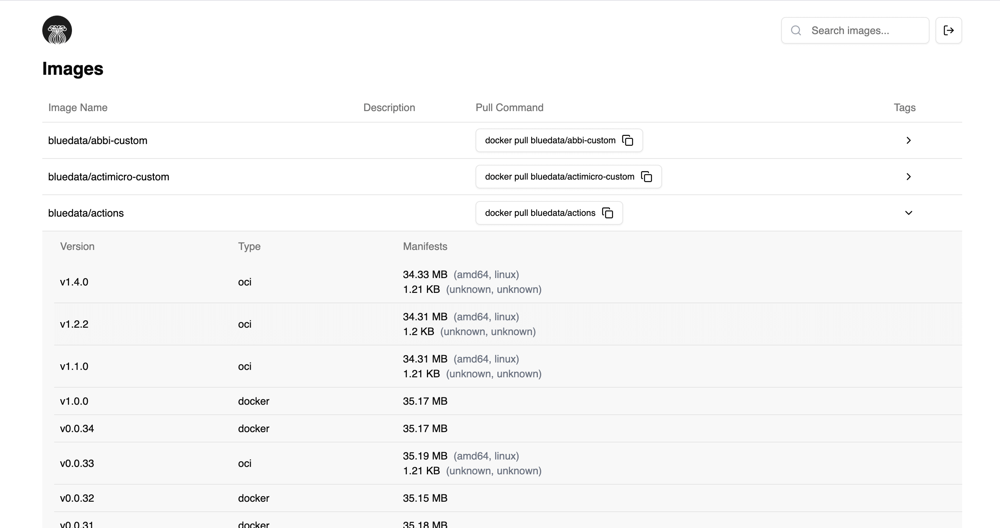

<div align="center" width="100%">
    
</div>

# Anemone

Anemone is a simple web UI for your private docker registry.



# Quickstart

## 🐳 Docker

```bash
docker run -d -p 8080:8080 --name anemone ghcr.io/aiibe/anemone --host https://YOUR-DOCKER-REGISTRY.com
```

Anemone will be available at http://localhost:8080

# Development

## Backend

Launch our backend

```bash
cd back
go run main.go --host https://your-docker-registry.com
```

## Frontend

In another terminal session, let's run our front app

```bash
cd front
yarn dev
```

# Production

## Build front and back

```bash
cd front
yarn build
cd ../back
go build -o anemone main.go
```

## Run

```bash
./anemone --host https://your-docker-registry.com
```
